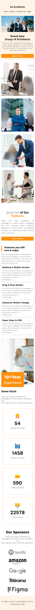

# g3-architects

## 📸 Screenshot ( DeskTop )

---

## 📸 Screenshot ( Tablet )

---

## 📸 Screenshot ( Mobile )

---

## 📁 Author Notes

> This is a good starter layout for a portfolio homepage. With a few improvements and proper styling, it can evolve into a complete personal website.